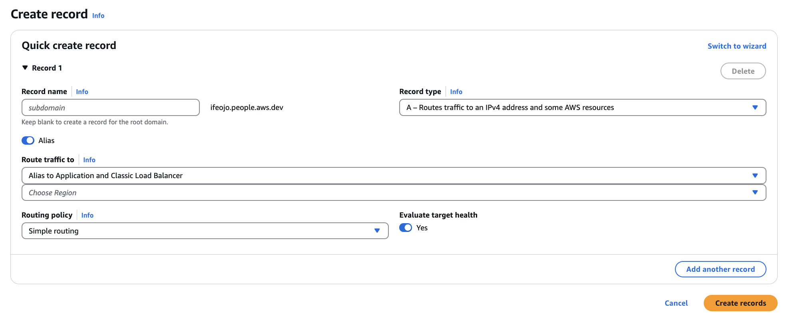

# Report Upload and Processing System

This project implements a serverless architecture for uploading, processing, and analyzing reports using Amazon Textract and Amazon Bedrock. It's built using the AWS CDK (Cloud Development Kit) in Python and includes a web application Streamlit frontend hosted on AWS Fargate for Amazon ECS

## **1.Architecture**


The system workflow is as follows:

1. A compliance report is uploaded to the S3 Report Upload Bucket.
2. An EventBridge rule triggers the Step Functions state machine. 
3. The workflow splits the report into non-compliance sections using PyMuPDF.
4. Amazon Textract and Amazon Bedrock extract factory-level information and non-compliance details from the relevant sections.
5. Pre-stored ratings for non-compliance issues are pulled from Amazon DynmaoDB, or a rating is suggested using Amazon Bedrock.
6. An email summarising the non-compliance issues is generated using Amazon Bedrock and is displayed in the UI.
7. The Streamlit frontend is secured with Amazon Cognito and an integrated OIDC identity provider.
8. The application is deployed on an AWS Fargate cluster behind an Application Load Balancer for scalability and availability.

## **2. Prerequisites**

### **Cognito Stack**
This stack sets up a Cognito pool with:
- Active OIDC-compliant Identity Provider (IdP)
- Client credentials from the IdP

#### **Secrets Manager Setup**
Create a secret in AWS Secrets Manager named `idpsecrets` with the following JSON structure:
```json
{
  "client_id": "YOUR_OIDC_CLIENT_ID",
  "client_secret": "YOUR_OIDC_CLIENT_SECRET", 
  "oidc_issuer": "https://YOUR_IDENTITY_PROVIDER_ISSUER_URL"
}
```

#### **OIDC Provider Configuration Details**
- **Scopes:** `['openid']`
- **Attribute Mapping:**
  - `GIVEN_NAME` → First Name
  - `FAMILY_NAME` → Last Name
  - `EMAIL` → Email Address
  - `UID` → Preferred Username
- **Callback and Logout URLs:**
  ```text
  callback_urls = ["https://YOUR_ACTUAL_DOMAIN/callback"]
  logout_urls = ["https://YOUR_ACTUAL_DOMAIN/logout"]
  ```
- Adjust scopes and attribute mapping as needed.


### **Network Stack**
- Secrets Manager secret named `acmSecret` containing:
  - SSL/TLS certificate ARN for an Amazon Certificate Manager certificate
- Cognito Domain, including:
  - **Cognito User Pool**
  - **Cognito App Client**
  - **Cognito Redirect URI**
  - **Cognito Identity Pool**

## **3. Main Components**

### **S3 Buckets**
- `report_bucket`: Stores uploaded reports
- `gradings_bucket`: Stores gradings

### **SNS Topic**
- Notifies teams when a review is complete.

### **DynamoDB Tables**
- `supplier_table`: Stores supplier details and audit issues.
- `compliance_grading_table`: Stores compliance gradings.

### **Lambda Functions**
1. `bedrock_supplier_extraction`: Extracts supplier details using Amazon Bedrock.
2. `email_approved`: Handles approved email requests.
3. `email_rejected`: Handles rejected email requests.
4. `extract_nc`: Extracts non-conformities from reports.
5. `generate_email`: Generates email content based on audit results.
6. `get_nc`: Retrieves non-conformity data.
7. `get_status`: Updates and retrieves processing status.
8. `report_split`: Splits the uploaded report into sections.
9. `send_emails`: Sends approval requests and confirmation emails.
10. `supplier_details`: Extracts and stores supplier details.
11. `upload_grading`: Uploads grading data to DynamoDB.
12. `validate_unrated_issues`: Validates and processes unrated issues.

### **Step Functions State Machine**
- Orchestrates the workflow from report upload to email generation.

### **API Gateway**
- Provides endpoints for approving or rejecting requests.

### **Network Stack**
- VPC configuration, ECS Fargate cluster, and ALB setup.
- Security groups for ECS and ALB.
- HTTPS listener with ACM certificate.

### **Cognito Authentication**
- User Pool for managing users.
- Identity Pool for AWS resource access.
- OIDC Identity Provider for federation.
- IAM roles for authenticated users.


## **4. Web Application**

The frontend:
- Built using Streamlit.
- Secured with Amazon Cognito.
- Deployed on ECS Fargate behind an ALB.
- Provides an intuitive interface for interacting with the system.

---

## **5. Deployment Options**

### Full Deployment
Includes the Cognito, network, and report upload components:
```bash
cdk deploy --context deploy_mode=full
```

### Report Upload Only
To deploy just the report upload and processing workflow (Step Functions and supporting Lambda functions):
```bash
cdk deploy --context deploy_mode=report-only
```

This option is provided for simpler deployments without requiring Cognito and networking elements.

---

## **6. Deployment Instructions**

### **Docker Assets Issue**
For macOS users encountering issues with Docker images being pushed as empty assets to ECR (e.g., `0MB` size):
- Before running `cdk deploy`, set the following environment variable:
  ```bash
  BUILDX_NO_DEFAULT_ATTESTATIONS=1
  ```

### **Build Lambda Layers**
Install colima if you do not have it installed
```bash
brew install colima
```

Ensure you navigate to the `lambda_layers` directory before building the layers:
```bash
cd lambda_layers
bash build-layers.sh [list layers]
```

If you encounter issues with Lambda layer size exceeding limits, consider manually reducing layer size by removing unnecessary dependencies or splitting them into multiple layers.

Note: the langchain-community layer is noticeably large, sqlalchemy & aiohttp are unused dependencies

### **Deploy the System**
1. To manually create a virtualenv on MacOS and Linux:
  ```bash
  python3 -m venv .venv
  ```

2. After the init process completes and the virtualenv is created, you can use the following step to activate your virtualenv.

  ```bash
  source .venv/bin/activate
  ```

3. Install dependencies:
   ```bash
   pip install -r requirements.txt
   ```
4. Deploy the desired stack(s):
   ```bash
   cdk deploy
   ```
5. Once deployed, go to your domain in Route 53 and an Alias A Record routed to your Application Load Balancer


---


## **7. Security**

- **S3 Buckets:** Configured with strict access controls.
- **IAM Policies:** Applied to Lambda functions and ECS tasks.
- **HTTPS:** Enforced for the web application.
- **Authentication:** Managed through Amazon Cognito.


## **8. Additional Notes**

- Tags: 
  - `project`: `{prefix}-esg-compliance`
  - `owner`: `esg-compliance`
  Replace `{prefix}` with your desired prefix.

- The project uses Amazon Bedrock for AI/ML capabilities.
- Email generation and sending are handled via Lambda functions.
- The system supports report splitting, extracting non-compliances, and validating unrated issues.


## Security

See [CONTRIBUTING](CONTRIBUTING.md#security-issue-notifications) for more information.

## License

This library is licensed under the MIT-0 License. See the LICENSE file.